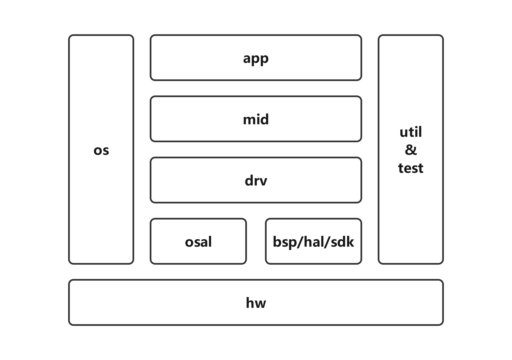

# ARCH

打造一款适用于嵌入式汽车电子MCU方面的通用架构。

* C语言
* GCC编译构建
* 面向对象思想
* 使用OS

## 01. 架构

## 99. 缩写

| 缩写 |                英文                |       中文       |
| :--: | :--------------------------------: | :--------------: |
| app |            application            |       应用       |
| arch |            architecture            |       架构       |
| bld |               build               |       构建       |
| bsp |       board support package       |    板级支持包    |
| cfg |           configuration           |       配置       |
| comm |           communication           |       通信       |
| dbg |               debug               |       调试       |
| def |               define               |       定义       |
| dev |               device               |       设备       |
| doc |           documentation           |       文档       |
| drv |               driver               |       驱动       |
| emc |   electro magnetic compatibility   |     电磁兼容     |
| gcc |      gnu compiler collection      |   gnu编译套件   |
| gnl |              general              |       通用       |
| gnu |           gnu's not unit           | 自由软件操作系统 |
| hal |     hardware abstraction layer     |    硬件抽象层    |
|  hw  |              hardware              |       硬件       |
|  io  |            input/output            |     输入输出     |
| lib |              library              |        库        |
| mcu |       micro controller unit       |     微控制器     |
| mgt |             management             |       管理       |
| mid |             middleware             |      中间件      |
| mod |               module               |       模块       |
| nvm |        non-volatile memory        |  非易失性存储器  |
| opt |              optional              |       可选       |
|  os  |          operating system          |     操作系统     |
| osal | operating system abstraction layer |  操作系统抽象层  |
| ots |         off tooling sample         |     工程样件     |
| out |               output               |       输出       |
| prj |              project              |       工程       |
| prot |              protocol              |       协议       |
| rel |              release              |       发布       |
| rqd |              required              |       必选       |
| sdk |      software development kit      |   软件开发套件   |
| src |               source               |        源        |
| srv |              service              |       服务       |
| util |              utility              |     公用设施     |
